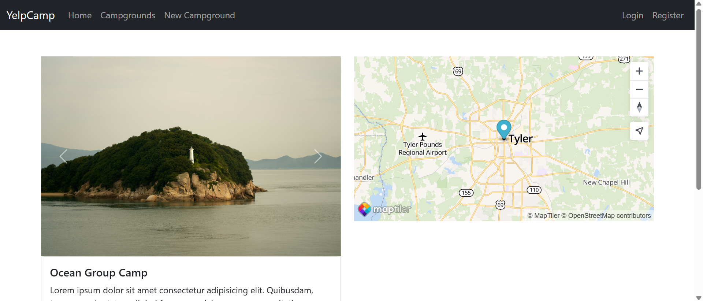

# YelpCamp

A full-stack web application for sharing and reviewing campgrounds. Built with Node.js, Express, MongoDB, EJS, and deployed on Render and Koyeb.

## Live Demo

- **Render:** [https://starcamp-0am6.onrender.com](https://starcamp-0am6.onrender.com)

## Features

- User authentication (register, login, logout)
- Add, edit, and delete campgrounds
- Upload images (Cloudinary integration)
- Add and delete reviews
- Map integration (MapTiler)
- Flash messages for user feedback
- Responsive Bootstrap UI

## Tech Stack

- Node.js
- Express.js
- MongoDB Atlas
- Mongoose
- Passport.js (authentication)
- EJS (templating)
- Cloudinary (image hosting)
- MapTiler (maps)
- Bootstrap 5

## Getting Started

### Prerequisites

- Node.js (v16 or higher recommended)
- MongoDB Atlas account
- Cloudinary account
- MapTiler account

### Installation

1. Clone the repository:
   ```bash
   git clone https://github.com/Hruthik2311/YelpCamp.git
   cd YelpCamp
   ```
2. Install dependencies:
   ```bash
   npm install
   ```
3. Create a `.env` file in the root directory and add the following:
   ```env
   DB_URL=your_mongodb_connection_string
   SECRET=your_session_secret
   CLOUDINARY_CLOUD_NAME=your_cloudinary_cloud_name
   CLOUDINARY_KEY=your_cloudinary_api_key
   CLOUDINARY_SECRET=your_cloudinary_api_secret
   MAPTILER_API_KEY=your_maptiler_api_key
   ```
4. Start the application:
   ```bash
   npm start
   ```
5. Visit `http://localhost:3000` in your browser.

## Deployment

### Render

- The app is configured to use the `PORT` environment variable for compatibility with Render.
- Add all required environment variables in the Render dashboard.

## Screenshots

Add your screenshots to the `assets` folder and reference them here:




<!-- Add or update image filenames as needed -->

## License

MIT

---

Feel free to contribute or open issues for suggestions and improvements!
